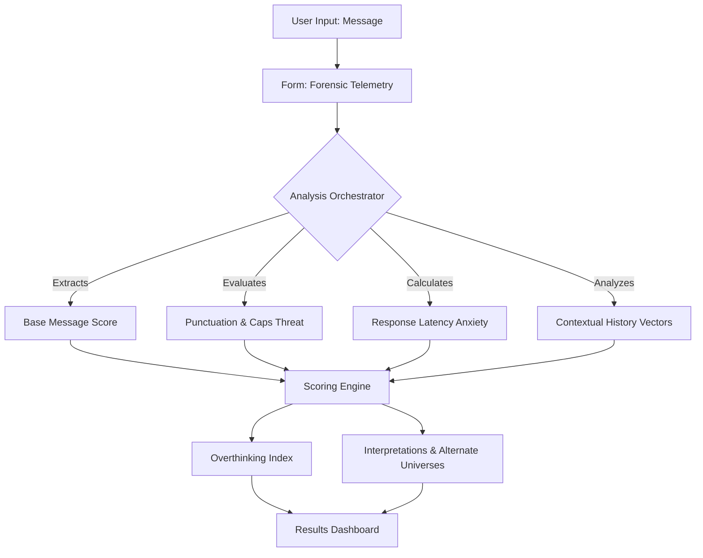

# Overthinking Calculator 🎯

## Basic Details
### Team Name: [Name]

### Team Members
- Team Lead: [Name] - [College]
- Member 2: [Name] - [College]
- Member 3: [Name] - [College]

### Project Description
The Overthinking Calculator is a deterministic analysis tool that evaluates simple text messages and mathematically computes exactly how much you are overthinking them, generating thousands of unnecessary hypothetical scenarios.

### The Problem (that doesn't exist)
Whenever someone replies with "okay.", "k", or uses a suspicious period at the end of a sentence, people spend hours of cognitive bandwidth trying to decode the subtext. This is a severe threat to global productivity.

### The Solution (that nobody asked for)
We built a highly complex, 10-factor forensic algorithm that takes a basic interaction, analyzes the capitalization, punctuation, response time latency, and emotional investment, and outputs a completely definitive "Overthinking Index" and alternate multiverse scenarios. It solves the problem by forcing you to realize how absurd you are being through cold, hard data.

## Technical Details
### Technologies/Components Used
For Software:
- TypeScript, HTML, CSS
- React, Vite
- Tailwind CSS, Framer Motion, Lucide React
- Node.js

### Implementation
For Software:
# Installation
```bash
npm install
```

# Run
```bash
npm run dev
```

### Project Documentation
For Software:

# Screenshots

*The main landing page showing the aesthetic neo-brutalist design and global telemetry.*


*The Forensic Parameters step where you input message latency, punctuation threats, and capitalization.*


*The Results Dashboard displaying the Overthinking Index, Verdict, and generated Alternate Universes.*

# Diagrams

*The user inputs telemetry -> the engine calculates factors -> results dashboard displays a highly-engineered anxiety dossier.*

### Project Demo
# Video
[Add your demo video link here]
*This video demonstrates a user inputting "okay." and receiving a 98% Overthinking Index with multiple red flags.*

# Additional Demos
[Add any extra demo materials/links]

## Team Contributions
- [Name 1]: [Specific contributions]
- [Name 2]: [Specific contributions]
- [Name 3]: [Specific contributions]

---
Made with ❤️ at TinkerHub Useless Projects 


